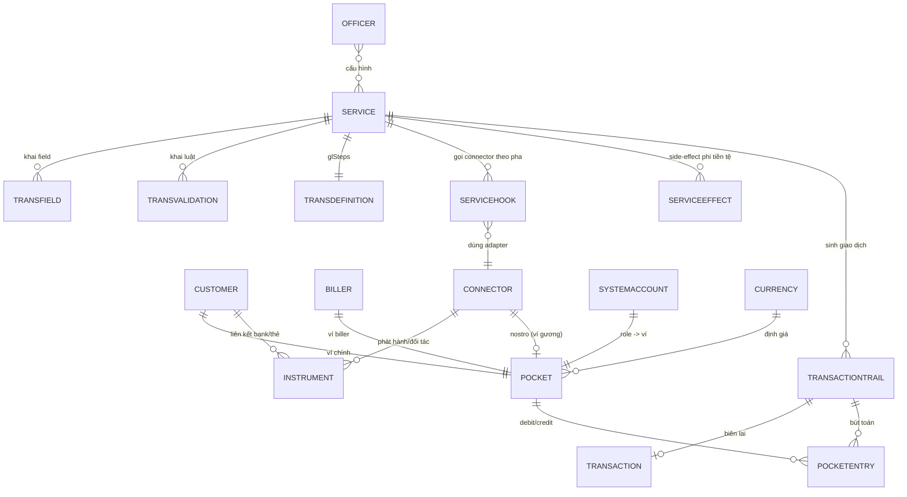
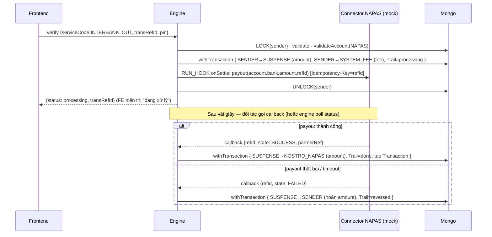
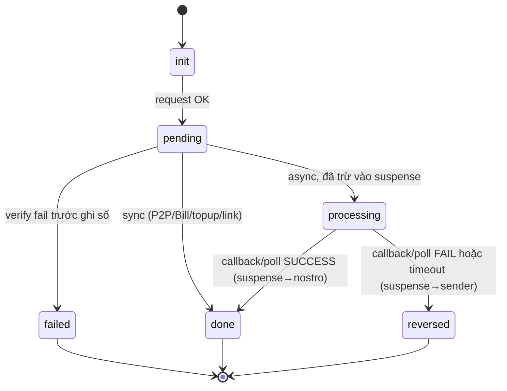

# 🧠 Thiết kế Engine xử lý tổng quát — Mini Wallet (config-driven)

> Tài liệu này **mở rộng** [`THIET-KE-TUAN-2.md`](./THIET-KE-TUAN-2.md). Mục tiêu: từ engine 3-runtime hiện tại (P2P / Cash-in / Bill) nâng lên một **engine generic thực sự** có thể chạy thêm **liên kết ngân hàng, liên kết thẻ, nạp tiền từ thẻ, chuyển/rút tiền liên ngân hàng (bất đồng bộ)** — tất cả chỉ bằng **thêm dòng config trong DB, không sửa code engine**.

## Mục lục
0. Tóm tắt 1 trang (đọc cái này trước)
1. Engine hiện tại đang "khoá cứng" ở đâu
2. 6 trục tổng quát hoá
3. Kiến trúc mới: Engine = Pipeline of Stages
4. Mô hình config mở rộng (Service + Connector + Instrument + Pocket roles + Trail states)
5. ERD cập nhật
6. Generic Connector Driver — 1 dòng config = 1 hệ thống ngoài
7. Thiết kế config 7 nghiệp vụ (bảng đầy đủ — phần chứng minh)
8. Sequence diagrams (link bank OTP · nạp thẻ 3DS · chuyển liên NH async + reversal)
9. Vòng đời bất đồng bộ & đối soát (state machine + callback + reconciliation)
10. Cookbook: thêm nghiệp vụ mới KHÔNG sửa code
11. Kịch bản demo
12. Bất biến (invariants) & bảo mật
13. Tác động lên ROADMAP

---

## 0. Tóm tắt 1 trang

Engine hiện tại đã đúng tinh thần config-driven, nhưng còn **3 chỗ phải sửa code mỗi khi thêm nghiệp vụ**: (a) `action` chỉ có `none|billerTrans` → không gọi được hệ thống ngoài khác (bank/thẻ/cổng chuyển tiền); (b) glStep `target` chỉ trỏ ví nội bộ + ví System/Bank cố định → không mô tả được dòng tiền ra/vào ngoài hệ thống; (c) chỉ có luồng **đồng bộ** → không xử lý được giao dịch **chờ ngân hàng đối tác trả kết quả**.

Bản thiết kế này gỡ cả 3 bằng **6 trục tổng quát hoá**, gói gọn trong một ý tưởng kiến trúc:

> **Engine = một pipeline gồm các "stage" generic. Mỗi runtime (Request / Confirm / Verify / Callback) chỉ là một danh sách stage được bật/tắt và tham số hoá bằng config. Mọi tiếp xúc với thế giới bên ngoài đi qua một `Connector` (adapter) khai báo bằng dữ liệu.**

Kết quả: thêm "liên kết ngân hàng" = tạo 1 `Service` với `glSteps = []` (không chuyển tiền) + 1 hook gọi `Connector` ngân hàng để gửi/kiểm OTP + 1 effect "tạo Instrument". Thêm "chuyển tiền sang ngân hàng khác" = 1 `Service` có glStep đẩy tiền vào ví **suspense**, 1 hook gọi cổng payout, và xử lý **callback** để chốt `done` hoặc **hoàn tiền** (`reversed`). Engine code không biết "ngân hàng" hay "thẻ" là gì — nó chỉ chạy stage theo config.

---

## 1. Engine hiện tại đang "khoá cứng" ở đâu

| # | Điểm khoá cứng (Tuần 2) | Hệ quả | Nghiệp vụ bị chặn |
|---|---|---|---|
| K1 | `Service.action ∈ {none, billerTrans}` + `actionParams={billerId}` | Chỉ gọi được **mock biller**. Mỗi loại hệ thống ngoài mới phải thêm `if` trong engine | Liên kết bank, liên kết thẻ, payout liên NH |
| K2 | glStep target chỉ `productLevel`/`wallet` + chôn cứng `<SYSTEM_POCKET_ID>`/`<BANK_POCKET_ID>` | Không khai báo được tiền **ra khỏi** hệ thống; sửa pocket id = sửa nhiều config | Rút/chuyển ra ngoài, nạp từ thẻ |
| K3 | Trail chỉ `init→pending→done/failed`, tiền chạy gọn trong 1 `withTransaction` đồng bộ | Không mô tả được trạng thái **đang chờ đối tác** và **hoàn tiền** sau đó | Mọi giao dịch async (liên NH, một số thẻ) |
| K4 | `auth.method ∈ {PIN, NONE}` | Không có OTP/3DS cho thao tác với bank/thẻ | Liên kết bank (OTP), thẻ (3DS) |
| K5 | "Thành công" = chỉ ghi sổ + tạo Transaction | Không có khái niệm "tạo/ kích hoạt một thực thể" (vd: lưu thẻ đã link) | Liên kết bank/thẻ (không có dòng tiền) |
| K6 | fieldBuilder query cố định vài hàm (`queryPocketByPhone`...) | Không lấy được "nguồn tiền là thẻ/ tài khoản đã liên kết" | Nạp từ thẻ, rút về bank đã link |

Sáu điểm này map 1–1 với sáu trục bên dưới.

---

## 2. Sáu trục tổng quát hoá

| Trục | Gỡ | Ý tưởng | Bản chất |
|---|----|---------|----------|
| **T1 — Hooks** | K1 | Thay `action` đơn lẻ bằng **danh sách hook** gắn vào *pha* của pipeline (`onRequest`, `onPreVerify`, `onSettle`, `onCallback`) | Cho phép gọi N hệ thống ngoài, ở đúng thời điểm |
| **T2 — Connector** | K1,K6 | Một model `Connector` mô tả cách nói chuyện với hệ thống ngoài (URL/auth/operations + map biến). Một **driver HTTP generic** đọc spec rồi gọi | Thêm bank/thẻ/cổng = thêm 1 dòng DB |
| **T3 — Instrument** | K6,K5 | Model `Instrument` = tài khoản bank / thẻ đã liên kết của khách (lưu **token**, không lưu số thật). fieldBuilder query được instrument làm nguồn/đích tiền | Có "nguồn tiền ngoài ví" |
| **T4 — Pocket roles + named accounts** | K2 | Thêm ownerType `nostro` (gương tiền ở đối tác) & `suspense` (tiền đang treo). glStep target thêm level `systemAccount` trỏ ví theo **vai trò** (SYSTEM_FEE, NOSTRO_NAPAS, CARD_ACQUIRER...) thay vì id cứng | Mô tả được tiền ra/vào ngoài hệ thống |
| **T5 — Async state machine + Callback runtime** | K3 | Trail thêm trạng thái `processing`/`reversed`; thêm **runtime thứ 4: Callback** để chốt hoặc hoàn giao dịch đang treo | Giao dịch chờ đối tác, đối soát, hoàn tiền |
| **T6 — Auth method mở rộng + Effects** | K4,K5 | `auth.method ∈ {NONE,PIN,OTP,3DS}`; thêm khối **`effects[]`** (side-effect phi tiền tệ: tạo/kích hoạt Instrument...) chạy trong cùng transaction với ghi sổ | OTP/3DS; "thành công" không chỉ là chuyển tiền |

---

## 3. Kiến trúc mới: Engine = Pipeline of Stages

Engine Tuần 2 mô tả Request "6 bước" và Verify "7 bước". Ta **giữ nguyên ngữ nghĩa đó** nhưng phát biểu lại thành thứ tổng quát hơn: mỗi runtime là một **danh sách stage có thứ tự**; mỗi *stage* là một **toán tử generic** đọc config. Nghiệp vụ khác nhau = **bật/tắt + tham số hoá** stage, không viết hàm mới.

### 3.1 Thư viện stage (cố định — code 1 lần)

| Stage | Việc làm | Đọc config từ | Có ở runtime |
|-------|----------|---------------|--------------|
| `BUILD_FIELDS` | Dựng biến TRANSBODY (fixed/mapping/query/**instrument**) | `Service.fieldBuilder` | Request, Verify |
| `VALIDATE_FORMAT` | Validate kiểu/độ dài/regex | `TransField` | Request, Verify |
| `RUN_HOOK(phase)` | Gọi Connector operation, map kết quả vào TRANSBODY | `Service.hooks[phase]` + `Connector` | mọi runtime |
| `COMPUTE_FEE` | Tính phí (fixed/percent + cap), set `DEBITFEE`,`TOTALAMOUNT` | `Service.feeConfig` | Request, Verify |
| `VALIDATE_BUSINESS` | Chạy validator nghiệp vụ theo tên | `TransValidation` | Request, Verify |
| `REQUIRE_AUTH` | Quyết định/kiểm phương thức xác thực | `Service.auth` | Confirm, Verify |
| `LOCK` / `UNLOCK` | Khoá/mở ví nguồn (chống chạy song song) | (tự động khi có glStep nguồn) | Verify, Callback |
| `EXECUTE_LEDGER` | Chạy `glSteps` (debit/credit) trong `session.withTransaction` | `TransDefinition.glSteps` | Verify, Callback |
| `APPLY_EFFECTS` | Side-effect phi tiền tệ (tạo/kích hoạt Instrument...) — cùng transaction | `Service.effects` | Verify, Callback |
| `FINALIZE` | Lật trạng thái Trail, tạo `Transaction`, trả envelope | (luôn) | mọi runtime |

> **Quy tắc bật stage:** stage chỉ chạy nếu config tương ứng **tồn tại & không rỗng**. Vd `EXECUTE_LEDGER` bỏ qua nếu `glSteps=[]` (đúng cho liên kết bank/thẻ). `RUN_HOOK(onRequest)` bỏ qua nếu không khai hook pha đó (đúng cho P2P).

### 3.2 Bốn runtime = bốn danh sách stage

```
REQUEST   : BUILD_FIELDS → VALIDATE_FORMAT → RUN_HOOK(onRequest) → COMPUTE_FEE
            → VALIDATE_BUSINESS → FINALIZE(status=pending, trả preview)

CONFIRM   : REQUIRE_AUTH → [RUN_HOOK(onConfirm) vd gửi OTP] → FINALIZE(trả authMethod)

VERIFY    : LOCK(source) → REQUIRE_AUTH(kiểm PIN/OTP/3DS) → BUILD_FIELDS → VALIDATE_FORMAT
            → COMPUTE_FEE → VALIDATE_BUSINESS → RUN_HOOK(onPreVerify)
            → [ session.withTransaction { EXECUTE_LEDGER → APPLY_EFFECTS → FINALIZE } ]
            → RUN_HOOK(onSettle)  →  UNLOCK(source)

CALLBACK  : (đối tác gọi về theo transRefId) RUN_HOOK(onCallback: parse)
            → LOCK(source) → session.withTransaction { EXECUTE_LEDGER(settle|reverse)
              → APPLY_EFFECTS → FINALIZE(done|reversed) } → UNLOCK(source)
```

So với Tuần 2, đây là **siêu tập hợp tương thích ngược**: P2P/Cash-in/Bill chỉ dùng các stage cũ; nghiệp vụ mới bật thêm `RUN_HOOK`, `APPLY_EFFECTS`, runtime `CALLBACK`.

### 3.3 Sơ đồ kiến trúc tầng

```
            ┌──────────────────────────────────────────────────────────┐
 HTTP  →    │ Controller (txn/request|confirm|verify|callback, admin/*) │
            └───────────────┬──────────────────────────────────────────┘
                            │ chuẩn hoá input, đóng dấu TRANSTEP, gắn user
            ┌───────────────▼───────────────┐
            │  NeonMessage.routeProcess      │  router theo TRANSTEP/Callback
            └───────────────┬───────────────┘
                            │
            ┌───────────────▼───────────────────────────────────────────┐
            │  PIPELINE EXECUTOR  (chạy danh sách stage theo config)      │
            │  BUILD_FIELDS · VALIDATE_* · COMPUTE_FEE · REQUIRE_AUTH ·   │
            │  LOCK · EXECUTE_LEDGER · APPLY_EFFECTS · FINALIZE · RUN_HOOK │
            └───┬───────────────────────┬───────────────────────┬────────┘
                │                       │                       │
   ┌────────────▼─────┐   ┌─────────────▼────────┐   ┌──────────▼─────────────┐
   │ Ledger (Pocket,  │   │ Config (Service,     │   │ Connector Driver       │
   │ PocketEntry,     │   │ TransField, …,       │   │ (HTTP generic adapter) │
   │ checksum, ACID)  │   │ TransDefinition,     │   │  ├─ bank gateway (mock)│
   │                  │   │ Connector, Instrument)│  │  ├─ card acquirer(mock)│
   └──────────────────┘   └──────────────────────┘   │  └─ payout rail (mock) │
                                                      └────────────────────────┘
```

---

## 4. Mô hình config mở rộng

### 4.1 `Service` (mở rộng — vẫn là "WHAT")

```jsonc
{
  "code": "INTERBANK_OUT", "name": "Chuyển tiền liên ngân hàng",
  "serviceType": "transfer_out", "currency": "VND",
  "fieldBuilder": [ /* … dựng TRANSBODY … */ ],
  "feeConfig": { "type": "percent", "value": 0.5, "min": 2000, "cap": 15000 },
  "auth": { "method": "PIN" },

  // ▼▼ MỚI: T1 hooks — gọi hệ thống ngoài theo pha
  "hooks": [
    { "phase": "onPreVerify", "connector": "NAPAS", "operation": "validateAccount",
      "inputMap": { "account": "DESTACCOUNT", "bankCode": "DESTBANK" },
      "outputMap": { "DESTNAME": "accountName" }, "onFailure": "abort" },
    { "phase": "onSettle",    "connector": "NAPAS", "operation": "payout",
      "inputMap": { "account": "DESTACCOUNT", "bankCode": "DESTBANK",
                    "amount": "AMOUNT", "refId": "TRANSREFID" },
      "outputMap": { "PARTNERREF": "partnerRef" },
      "idempotencyKey": "TRANSREFID", "onFailure": "markProcessing" }
  ],

  // ▼▼ MỚI: T6 effects — side-effect phi tiền tệ chạy CÙNG transaction ghi sổ
  "effects": [],            // vd link bank: [{ "type":"activateInstrument","ref":"INSTRUMENTID" }]

  // ▼▼ MỚI: tham chiếu định nghĩa async (xem 4.5)
  "settlement": { "mode": "async", "timeoutSec": 120, "onTimeout": "reverse" },

  "enabled": true
}
```

`feeConfig` cũng tổng quát hoá: `type ∈ {fixed, percent}`; `percent` kèm `min`/`cap` để chặn sàn/trần.

### 4.2 `Connector` (MỚI — adapter khai báo bằng dữ liệu) — T2

```jsonc
{
  "code": "NAPAS", "name": "Cổng chuyển tiền liên NH (mock)",
  "kind": "payout",                       // biller | bank | card | payout
  "baseUrl": "http://localhost:1337/mock/napas",
  "auth": { "type": "hmac", "secretRef": "NAPAS_SECRET" },  // hoặc apiKey/none
  "operations": {
    "validateAccount": { "method": "POST", "path": "/validate",
       "request":  { "account": "$.account", "bankCode": "$.bankCode" },
       "response": { "accountName": "$.data.name", "ok": "$.err==200" } },
    "payout":          { "method": "POST", "path": "/payout",
       "request":  { "account": "$.account", "bankCode": "$.bankCode",
                     "amount": "$.amount", "refId": "$.refId" },
       "response": { "partnerRef": "$.data.ref", "state": "$.data.state" },
       "idempotent": true },
    "status":          { "method": "POST", "path": "/status",
       "request":  { "refId": "$.refId" },
       "response": { "state": "$.data.state" } }
  }
}
```

**Driver generic** (code 1 lần): nhận `(connector, operationName, args)` → dựng HTTP request theo `request` map (JSONPath từ `args`), ký theo `auth`, gọi, rồi map `response` về object trả cho hook. Engine **không** biết NAPAS/VISA là gì.

### 4.3 `Instrument` (MỚI — nguồn/đích tiền ngoài ví) — T3

```jsonc
{
  "customer": "<customerId>",
  "type": "bankAccount",                 // bankAccount | card
  "connector": "VCB",                    // bank/card network nào
  "token": "tok_9f3a…",                  // token hoá — KHÔNG lưu số thật/PAN
  "maskedNumber": "**** **** **** 4321",
  "holderName": "NGUYEN VAN A",
  "meta": { "bankCode": "VCB", "expMonth": 8, "expYear": 2028 },
  "status": "active"                     // pending | active | disabled
}
```

fieldBuilder thêm nguồn biến `instrument`: `SOURCEINSTRUMENT = instrument queryInstrument(parameters.instrumentId)` → nạp token/connector để hook charge/payout dùng.

### 4.4 `Pocket` (mở rộng ownerType) — T4

`ownerType ∈ { customer, system, bank, biller, nostro, suspense }`

- **nostro** — "ví gương" phản ánh số dư ta giữ tại 1 đối tác (1 nostro / connector). Tiền ra ngoài = credit nostro.
- **suspense** — ví treo tiền **đang đi** (in-flight) trong giao dịch async; chốt thành công → suspense ra nostro; hoàn → suspense trả lại khách.

glStep `target` thêm level `systemAccount` resolve theo **vai trò** (bảng `SystemAccount` map role→pocketId, seed 1 lần) thay vì chôn id:

| level | nghĩa | ví dụ target |
|-------|-------|--------------|
| `productLevel` | resolve từ biến TRANSBODY | `SENDERID`, `RECEIVERID` |
| `instrument`   | resolve ví/nostro gắn với instrument | `SOURCEINSTRUMENT` |
| `systemAccount`| resolve theo role | `SYSTEM_FEE`, `BANK_FUNDING`, `NOSTRO_NAPAS`, `CARD_ACQUIRER`, `SUSPENSE_PAYOUT` |
| `wallet`       | id ví tuyệt đối (giữ tương thích Tuần 2) | `<pocketId>` |

### 4.5 `TransactionTrail.status` (mở rộng) — T5

```
init → pending → processing → done
                      │          
                      ├────────→ reversed     (đối tác từ chối / timeout → hoàn tiền)
   (lỗi trước ghi sổ) └────────→ failed        (chưa đụng tới tiền)
```

- `processing`: đã trừ tiền khách vào **suspense**, đang chờ đối tác.
- `done`: callback/POLL báo OK → chuyển suspense → nostro.
- `reversed`: đối tác fail/timeout → hoàn suspense → khách (ghi sổ ngược, cùng transRefId).

`transStepLog[]` ghi từng stage (input/output/thời điểm) phục vụ Trail viewer & đối soát.

---

## 5. ERD cập nhật



Thực thể **mới** so với Tuần 2: `Connector`, `Instrument`, `SystemAccount`, `ServiceHook`, `ServiceEffect` (3 cái sau có thể nhúng dạng JSON trong `Service` cho gọn — xem §10). `Pocket.ownerType` thêm `nostro`/`suspense`. `TransactionTrail.status` thêm `processing`/`reversed`.

---

## 6. Generic Connector Driver — 1 dòng config = 1 hệ thống ngoài

Driver là **trái tim của tổng quát hoá ngoại vi**. Pseudo-code (đặt ở `api/helpers/call-connector.js`):

```js
// callConnector(connectorCode, operationName, args, ctx)
const c  = await Connector.findOne({ code: connectorCode });
const op = c.operations[operationName];               // spec khai báo
const body = renderTemplate(op.request, args);        // JSONPath: args -> body
const headers = signRequest(c.auth, body, ctx);       // hmac/apiKey/none
const res = await httpCall(c.baseUrl + op.path, op.method, body, headers,
                           { idempotencyKey: args.idempotencyKey });
const mapped = extract(op.response, res);             // JSONPath: res -> {field: value}
logStep(ctx.trail, { connector: connectorCode, op: operationName, body, res });
return mapped;                                        // hook ghi mapped vào TRANSBODY
```

Đặc tính bắt buộc của driver:
- **Idempotent**: với operation `idempotent:true`, gửi `Idempotency-Key = TRANSREFID` → gọi lại payout không trừ tiền 2 lần ở đối tác.
- **Timeout + phân loại lỗi**: `network/timeout` → `processing` (chờ callback/poll), `business reject` → `abort`/`reverse` theo `onFailure`.
- **Không rò bí mật**: secret đọc từ `sails.config.custom`/env qua `secretRef`, không log token/PAN.

`onFailure` của hook: `abort` (huỷ, trail `failed`, chưa ghi sổ) · `ignore` (bỏ qua, đi tiếp) · `markFailed` (đánh dấu fail sau khi đã làm gì đó) · `markProcessing` (treo, chờ callback) · `reverse` (hoàn tiền).

Mock cho demo: 3 connector giả `VCB` (bank link/OTP), `VISA` (card 3DS/charge), `NAPAS` (payout liên NH) — chỉ là vài route Express/Sails trả JSON, **không** thuộc engine.

---

## 7. Thiết kế config 7 nghiệp vụ (phần chứng minh)

Cùng một engine, 7 nghiệp vụ chỉ khác **dữ liệu config**. Cột "stage bật thêm" cho thấy engine không thêm code.

| # | Service | glSteps? | Hook (connector/op) | auth | settlement | effect | Stage bật thêm so với P2P |
|---|---------|:--------:|---------------------|:----:|:----------:|--------|---------------------------|
| 1 | **P2P** chuyển nội bộ | 2 | — | PIN | sync | — | (baseline) |
| 2 | **Cash-in** (officer nạp) | 1 | — | NONE | sync | — | (bỏ confirm) |
| 3 | **Bill** trả hoá đơn | 2 | onRequest=inquiry, onPreVerify=payment (biller) | PIN | sync | — | RUN_HOOK |
| 4 | **Link bank** | 0 | onConfirm=sendOtp, onPreVerify=verifyOtp (VCB) | OTP | sync | createInstrument | RUN_HOOK + APPLY_EFFECTS, **tắt** EXECUTE_LEDGER |
| 5 | **Link thẻ** | 0 | onPreVerify=tokenize+3DS (VISA) | 3DS | sync | createInstrument | RUN_HOOK + APPLY_EFFECTS, tắt LEDGER |
| 6 | **Nạp từ thẻ** | 1 | onPreVerify=charge (VISA) | 3DS | sync* | — | RUN_HOOK; nguồn = CARD_ACQUIRER |
| 7 | **Chuyển/Rút liên NH** | 2 (+reverse) | onPreVerify=validateAccount, onSettle=payout, onCallback (NAPAS) | PIN | **async** | — | RUN_HOOK + runtime CALLBACK + suspense |

\* Nạp từ thẻ có thể sync (charge trả ngay) hoặc async tuỳ acquirer — chỉ đổi `settlement.mode`.

### 7.1 Chi tiết — #4 Liên kết ngân hàng (không có dòng tiền)

```jsonc
fieldBuilder: [
  { name:"BANKCODE",  source:"mapping", from:"parameters.bankCode" },
  { name:"ACCOUNTNO", source:"mapping", from:"parameters.accountNo" },
  { name:"USERID",    source:"context", from:"auth.userId" }
]
TransField: [ {SERVICEID req}, {BANKCODE regex ^[A-Z]{3,8}$}, {ACCOUNTNO regex ^\d{6,19}$} ]
TransValidation: [ "validateInstrumentNotDuplicated(USERID:BANKCODE:ACCOUNTNO)" ]
feeConfig: { type:"fixed", value:0 }
auth: { method:"OTP" }
hooks: [
  { phase:"onConfirm",   connector:"VCB", operation:"sendOtp",
    inputMap:{ account:"ACCOUNTNO" }, outputMap:{ OTPREF:"otpRef" } },
  { phase:"onPreVerify", connector:"VCB", operation:"verifyOtp",
    inputMap:{ otpRef:"OTPREF", otp:"OTP", account:"ACCOUNTNO" },
    outputMap:{ INSTRTOKEN:"token", HOLDERNAME:"name" }, onFailure:"abort" }
]
glSteps: []                                  // ⟵ KHÔNG chuyển tiền
effects: [ { type:"createInstrument",
             with:{ type:"bankAccount", connector:"VCB",
                    token:"INSTRTOKEN", holderName:"HOLDERNAME",
                    masked:"ACCOUNTNO", status:"active" } } ]
```

> Đây là phép thử quan trọng nhất của tính generic: **một nghiệp vụ không có tiền chạy** vẫn dùng đúng pipeline (request→confirm→verify), chỉ là `EXECUTE_LEDGER` tự tắt vì `glSteps=[]`, còn "thành công" nghĩa là `APPLY_EFFECTS` tạo Instrument.

### 7.2 Chi tiết — #6 Nạp tiền từ thẻ đã liên kết

```jsonc
fieldBuilder: [
  { name:"CURRENCY", source:"fixed", value:"VND" },
  { name:"AMOUNT",   source:"mapping", from:"parameters.amount" },
  { name:"RECEIVERID", source:"query", fn:"queryPocketByUserId", arg:"USERID" },
  { name:"SOURCEINSTRUMENT", source:"instrument", fn:"queryInstrument",
    arg:"parameters.instrumentId" }            // phải là card của chính USERID
]
feeConfig: { type:"fixed", value:0 }
auth: { method:"3DS" }
hooks: [
  { phase:"onPreVerify", connector:"VISA", operation:"charge",
    inputMap:{ token:"SOURCEINSTRUMENT.token", amount:"AMOUNT", refId:"TRANSREFID" },
    outputMap:{ PARTNERREF:"authCode" }, idempotencyKey:"TRANSREFID", onFailure:"abort" }
]
glSteps: [
  { order:0, amount:"AMOUNT", debit:{level:"systemAccount",target:"CARD_ACQUIRER"},
                              credit:{level:"productLevel", target:"RECEIVERID"} }
]
```

Tiền vào hệ thống từ **ví CARD_ACQUIRER** (gương tiền acquirer trả về) → ví khách. Charge thẻ thành công *trước* khi ghi sổ; nếu charge fail → `abort`, không ghi sổ.

### 7.3 Chi tiết — #7 Chuyển/Rút liên ngân hàng (async)

```jsonc
feeConfig: { type:"percent", value:0.5, min:2000, cap:15000 }
auth: { method:"PIN" }
settlement: { mode:"async", timeoutSec:120, onTimeout:"reverse" }
hooks: [
  { phase:"onPreVerify", connector:"NAPAS", operation:"validateAccount",
    inputMap:{ account:"DESTACCOUNT", bankCode:"DESTBANK" },
    outputMap:{ DESTNAME:"accountName" }, onFailure:"abort" },
  { phase:"onSettle", connector:"NAPAS", operation:"payout",
    inputMap:{ account:"DESTACCOUNT", bankCode:"DESTBANK", amount:"AMOUNT", refId:"TRANSREFID" },
    outputMap:{ PARTNERREF:"partnerRef", PARTNERSTATE:"state" },
    idempotencyKey:"TRANSREFID", onFailure:"markProcessing" }
]

// VERIFY ghi sổ: khách -> SUSPENSE (treo) + phí -> SYSTEM_FEE, trail = processing
glSteps_verify: [
  { order:0, amount:"AMOUNT",   debit:{productLevel:"SENDERID"},
                                 credit:{systemAccount:"SUSPENSE_PAYOUT"} },
  { order:1, amount:"DEBITFEE", debit:{productLevel:"SENDERID"},
                                 credit:{systemAccount:"SYSTEM_FEE"} }
]
// CALLBACK done : SUSPENSE -> NOSTRO_NAPAS  (tiền thực sự rời hệ thống)   → trail=done
// CALLBACK fail : SUSPENSE -> SENDERID (+ hoàn phí tuỳ chính sách)         → trail=reversed
```

**Bất biến không mất tiền:** tại mọi thời điểm tiền hoặc ở ví khách, hoặc ở suspense, hoặc ở nostro — tổng luôn bảo toàn; reversal là bút toán ngược cùng `transRefId`.

---

## 8. Sequence diagrams

### 8.1 Liên kết ngân hàng (OTP, không có dòng tiền)

```mermaid
sequenceDiagram
    participant FE as Frontend
    participant EN as Engine (pipeline)
    participant VCB as Connector VCB (mock)
    participant DB as Mongo

    FE->>EN: request {serviceCode:LINK_BANK, bankCode, accountNo}
    EN->>DB: BUILD_FIELDS + VALIDATE + Trail(pending)
    EN-->>FE: preview {transRefId}  (fee=0)

    FE->>EN: confirm {transRefId}
    EN->>VCB: RUN_HOOK onConfirm: sendOtp(account)
    VCB-->>EN: otpRef
    EN-->>FE: {authMethod: OTP, transRefId}

    FE->>EN: verify {transRefId, otp}
    EN->>VCB: RUN_HOOK onPreVerify: verifyOtp(otpRef, otp)
    alt OTP đúng
        VCB-->>EN: {token, name}
        EN->>DB: session.withTransaction { glSteps=[] (skip) ; APPLY_EFFECTS: createInstrument(active) ; Trail=done }
        EN-->>FE: {linked: ****4321}
    else OTP sai
        VCB-->>EN: error
        EN->>DB: Trail=failed
        EN-->>FE: {err: OTP_INVALID}
    end
```

### 8.2 Nạp tiền từ thẻ (3DS + charge)

```mermaid
sequenceDiagram
    participant FE as Frontend
    participant EN as Engine
    participant VISA as Connector VISA (mock)
    participant DB as Mongo

    FE->>EN: request {serviceCode:CARD_TOPUP, instrumentId, amount}
    EN->>DB: BUILD_FIELDS (load card token) + VALIDATE + Trail(pending)
    EN-->>FE: preview {amount, fee:0, transRefId}
    FE->>EN: confirm → {authMethod: 3DS, transRefId}
    FE->>EN: verify {transRefId, otp/3ds}
    EN->>VISA: RUN_HOOK onPreVerify: charge(token, amount, refId)
    alt charge OK
        VISA-->>EN: {authCode}
        EN->>DB: withTransaction { glSteps: CARD_ACQUIRER → RECEIVERID ; Trail=done }
        EN-->>FE: {credited, newBalance}
    else charge fail
        VISA-->>EN: declined
        EN->>DB: Trail=failed (chưa ghi sổ)
        EN-->>FE: {err: CARD_DECLINED}
    end
```

### 8.3 Chuyển liên ngân hàng (async + callback + reversal)



---

## 9. Vòng đời bất đồng bộ & đối soát

**Callback runtime** (`POST /api/txn/callback/:connector`): xác thực chữ ký connector → đọc `refId` → nạp Trail → chỉ xử lý nếu `status=processing` (idempotent: callback trùng bị bỏ qua) → chạy glSteps settle/reverse trong transaction → `done|reversed`.

**Polling dự phòng** (job định kỳ): với Trail `processing` quá `now()` mà chưa có callback, engine gọi `Connector.status(refId)`; nếu đối tác đã `SUCCESS/FAILED` → tự settle/reverse; nếu quá `timeoutSec` và vẫn chưa rõ → áp `onTimeout` (mặc định `reverse`).

**Đối soát (reconciliation):** mỗi connector có ví `nostro`. Cuối ngày so:
`Σ PocketEntry credit vào NOSTRO_X` (theo sổ ta) **==** sao kê đối tác X. Lệch → liệt kê Trail `processing` treo. Đây là lý do bắt buộc dùng `nostro` thay vì cho tiền "bốc hơi".

State machine (đầy đủ):



---

## 10. Cookbook — thêm nghiệp vụ mới KHÔNG sửa code

> Quy trình cho Officer trong Admin Portal. Mỗi bước là **điền form/JSON**, không deploy.

1. **(Nếu cần hệ thống ngoài mới)** Tạo `Connector`: điền `baseUrl`, `auth`, và các `operations` (request/response map). → kiểm bằng nút "Test operation".
2. **(Nếu tiền ra/vào ngoài)** Tạo/seed ví `nostro`/`suspense` + map `SystemAccount` role → pocketId.
3. Tạo `Service`: `fieldBuilder`, `feeConfig`, `auth.method`.
4. Khai `TransField` (định dạng) + `TransValidation` (luật) — chọn từ thư viện validator có sẵn.
5. Khai `hooks[]` (pha + connector + operation + inputMap/outputMap + onFailure).
6. Khai `glSteps` (rỗng nếu không chuyển tiền) + `effects` (nếu cần tạo/kích hoạt Instrument).
7. Đặt `settlement.mode` (`sync`/`async`) + bật `enabled`.
8. Bấm **Validate config** (lint: glSteps cân bằng, biến hook tồn tại trong TRANSBODY, role ví đã seed) → **demo** ngay trên Customer UI.

Ví dụ "P2P kèm lời nhắn" hay "Top-up ví từ ngân hàng đã link" chỉ là tổ hợp lại các khối trên — **0 dòng code**.

---

## 11. Kịch bản demo (cho buổi trình bày)

1. **Engine không biết nghiệp vụ** — mở code: chỉ có thư viện stage + driver; không có chữ "P2P"/"bank"/"card" nào trong engine.
2. **Link bank**: Customer link VCB → nhập OTP `123456` (mock) → Instrument `active` xuất hiện. (Chứng minh nghiệp vụ **không có tiền** chạy đúng pipeline.)
3. **Nạp từ thẻ**: link VISA → nạp 200.000 → số dư tăng; mở Trail xem hook `charge` + glStep `CARD_ACQUIRER→khách`.
4. **Chuyển liên NH (async)**: chuyển 500.000 ra VCB → UI hiện *"đang xử lý"* (Trail `processing`, tiền nằm ở **suspense**) → bấm "mock callback SUCCESS" → `done` (suspense→nostro). Lặp lại 1 lệnh khác → "mock callback FAIL" → `reversed`, tiền **về lại** ví khách.
5. **Đối soát**: mở màn Reconciliation → Σ nostro NAPAS khớp sao kê mock.
6. **Tạo nghiệp vụ mới live**: trong Admin, clone P2P thành "P2P + lời nhắn" chỉ bằng thêm 1 TransField → chạy được ngay (không restart server).

> Mỗi bước đều mở **Trail viewer** xem `transStepLog` để thấy engine chạy các stage theo config.

---

## 12. Bất biến (invariants) & bảo mật

- **I1 — Tiền chỉ chạy ở Verify/Callback**, trong `session.withTransaction`. Request/Confirm không đụng số dư.
- **I2 — glSteps cân bằng**: mỗi step debit == credit cùng `amount`; tổng hệ thống bảo toàn (kể cả suspense/nostro/reversal).
- **I3 — Không mất tiền async**: tiền in-flight luôn nằm ở `suspense`; chỉ rời khi `done` (→nostro) hoặc quay về khi `reversed` (→khách).
- **I4 — Idempotency 2 lớp**: (a) callback xử lý 1 lần theo `status=processing`; (b) payout/charge gửi `Idempotency-Key=transRefId` để đối tác không trừ 2 lần.
- **I5 — Khoá ví nguồn** ở mọi runtime đụng tiền; **mở khoá ở mọi lối thoát** (kể cả lỗi/exception).
- **I6 — Checksum ví** tính lại ngay sau mọi thay đổi balance (mọi glStep).
- **I7 — Bảo mật instrument**: chỉ lưu **token + masked**, không bao giờ lưu PAN/CVV/số tài khoản đầy đủ; secret connector đọc từ env, không log.
- **I8 — Quyền sở hữu**: instrument dùng làm nguồn/đích phải thuộc đúng `USERID` (validator bắt buộc), tránh dùng thẻ người khác.

---

## 13. Tác động lên ROADMAP

Dự án từ "3 nghiệp vụ Tuần 2" mở rộng thành **nền tảng giao dịch config-driven**. Các giai đoạn bổ sung (đã thêm vào [`ROADMAP.md`](./ROADMAP.md)):

- **GĐ A — Connector layer**: model `Connector` + `call-connector` driver generic + 3 mock (VCB/VISA/NAPAS) + nút "Test operation".
- **GĐ B — Instrument & pipeline hooks**: model `Instrument`, nguồn fieldBuilder `instrument`, stage `RUN_HOOK`/`APPLY_EFFECTS`, auth `OTP`/`3DS` → chạy **Link bank** + **Link thẻ** + **Nạp từ thẻ**.
- **GĐ C — Async settlement**: ownerType `nostro`/`suspense` + `SystemAccount` roles, trail `processing`/`reversed`, **runtime Callback** + polling → chạy **Chuyển/Rút liên NH**.
- **GĐ D — Đối soát & vận hành**: màn Reconciliation, Trail viewer mở rộng (xem hook log), Connector CRUD trong Admin.
- **GĐ E — Hardening**: test idempotency callback, reversal, timeout, không-mất-tiền (property test tổng số dư bảo toàn).

---

*Liên hệ thiết kế cũ:* mọi khái niệm Tuần 2 (3 runtime, 5 khối config, FK `String(service._id)`, phí về System, ACID ở Verify, khoá/mở ví) **được giữ nguyên**; tài liệu này chỉ bổ sung 6 trục để biến chúng thành tổng quát.
