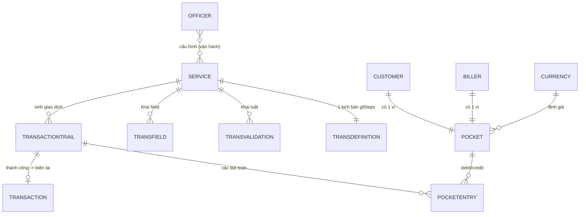
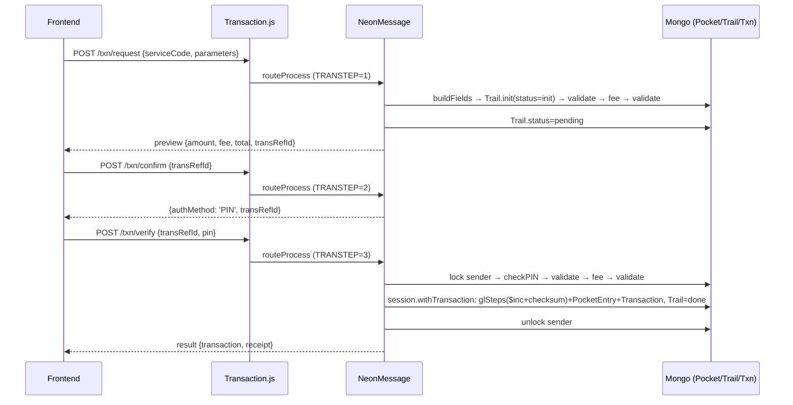
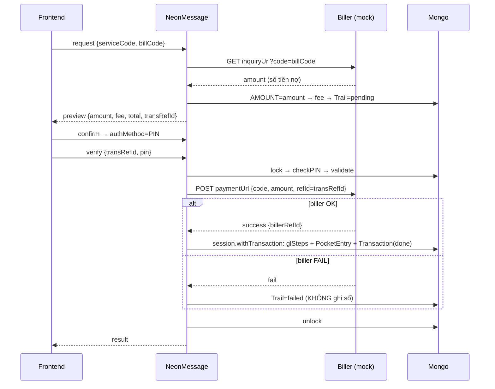

# 📐 Bản thiết kế Tuần 2 — Mini Wallet

## Mục lục
0. Quyết định thiết kế 
1. Kiến trúc engine 3 runtime
2. ERD + Data dictionary
3. Đặc tả API (high-level)
4. Thiết kế config 3 nghiệp vụ
5. Sequence diagram (P2P + Bill)
6. Wireframe Admin Portal (7 màn)
7. Thiết kế Seed
8. Backlog (MUST/NICE + ước lượng)
9. Design review gate

---

## 0. Quyết định thiết kế 

Brief là "định hướng mềm" — cho phép đổi tên trường miễn giữ đúng vai trò. Các chỗ ta cố ý lệch:

| # | Brief | Thiết kế của ta | Lý do |
|---|-------|------------------|-------|
| 1 | Pocket `client`/`user` | `ownerType`/`ownerRef` | Tên rõ nghĩa hơn; vai trò y hệt |
| 2 | Currency `MMK` | `VND` | Bản địa hoá; chỉ là dữ liệu config |
| 3 | `TransDefinition.code` (giữ `String(service._id)`) | đặt tên field là `service` | Tránh nhầm "code" với `service.code` (đúng cảnh báo brief mục 9) |
| 4 | Trail có `transRefId` | dùng thẳng `trail.id` làm `transRefId` | Brief mục 1 nói `transRefId = trail.id` → bỏ field thừa |

Mọi chỗ khác **bám đúng brief**: 3 runtime, 5 khối config, FK config = `String(service._id)`, glStep `level/target`, phí về ví System, tiền chỉ chạy ở Verify trong `session.withTransaction`, khoá/mở khoá sender.

---

## 1. Kiến trúc engine 3 runtime

Một giao dịch = **3 lần gọi API**, chung một `TransactionTrail` nhận diện bằng `transRefId (= trail.id)`.

```
Controller
  → Transaction.engine{Request|Confirm|Verify}Transaction   (vỏ: chuẩn hoá input, đóng dấu TRANSTEP=1/2/3, gắn dataObject.user)
      → NeonMessage.routeProcess(transInput)                (router: switch theo TRANSTEP)
          TRANSTEP 1 → processRequestStep
          TRANSTEP 2 → processConfirmStep
          TRANSTEP 3 → processVerifyStep
  ← envelope { err, message, ...data }
```

Trong Sails ta hiện thực:
- `Transaction.js` + `NeonMessage.js`: đặt trong `api/services/` (module thường, `require`) hoặc gói mỗi runtime thành 1 helper trong `api/helpers/`.
- Các hàm con: `Service.buildTransactionFields`, `TransField.validateFields`, `TransValidation.validateTransaction`, `TransDefinition.ExecuteTransaction` → để dạng helper (`sails.helpers.*`) hoặc static method gắn trên model.

**Bất biến:** Request kết thúc ở `status='pending'` (không trừ đồng nào); tiền chỉ chạy ở Verify trong **một** `session.withTransaction`.

### 1.1 Request — `processRequestStep` (6 bước)
1. `Service.buildTransactionFields` — đọc `service.fieldBuilder` → dựng danh sách biến phẳng (`fixed`/`mapping`/`query`) ⇒ `transInput`.
2. `TransactionTrail.init` — đưa biến vào **TRANSBODY** theo `TransField`; dựng `inputMessage`+`outputMessage`; tạo Trail `status='init'`; gán `outputMessage.TRANSBODY.TRANSREFID = trail.id`.
3. `TransField.validateFields` — validate **định dạng** (kiểu/độ dài/regex).
   - 3.1 *(chỉ Bill)* gọi `inquiryUrl` → **ghi đè `AMOUNT`**.
4. Tính **phí** → `TOTALAMOUNT = AMOUNT + DEBITFEE`.
5. `TransValidation.validateTransaction` — kiểm **luật nghiệp vụ**.
6. Update Trail `status='pending'`; trả **preview** `{ amount, fee, total, transRefId }`.

### 1.2 Confirm — `processConfirmStep`
Nạp lại Trail theo `transRefId`, đọc `service.auth.method` → trả `{ errorCode: 0, authMethod, transRefId }`. `PIN` → frontend gửi kèm PIN ở Verify; `NONE` → gọi thẳng. *(Cash-in: server tự `request` → `verify`, bỏ confirm.)*

### 1.3 Verify — `processVerifyStep` (7 bước) ★ tiền chạy
1. `validateStateAndLock(SENDERID)` — khoá ví gửi (`state='inProgress'`) chống chạy song song.
2. Xác thực **PIN** (nếu `PIN`); `NONE` → qua.
3. `TransField.validateFields` — validate lại định dạng.
4. Tính **phí** lại từ đầu (không tin số cũ).
5. `TransValidation.validateTransaction` — kiểm lại luật (số dư có thể đã đổi).
   - 5.1 *(chỉ Bill)* gọi `paymentUrl`; biller fail → Trail `failed`, **không ghi sổ**.
6. `TransDefinition.ExecuteTransaction` — đọc `glSteps`, chuyển tiền từng step, ghi `PocketEntry`, tạo `Transaction`, lật Trail `pending→done` — **toàn bộ trong một `session.withTransaction`** (ACID).
7. `releaseAccount(SENDERID)` — **mở khoá** ví gửi ở **mọi** lối ra.

> ⚠️ Cạm bẫy hay quên: mọi nhánh thoát của Verify (kể cả lỗi) đều phải mở khoá ví đã khoá ở B1.

---

## 2. ERD + Data dictionary



**Data dictionary (field chính):**

- **Currency**: `code` (VND), `name`, `decimal`.
- **Customer**: `phone` (unique), `pinHash`, `pocket` (ref), `status`.
- **Officer**: `username` (unique), `passwordHash`, `status`. *(Không RBAC.)*
- **Biller**: `code` (unique), `name`, `pocket` (ref), `inquiryUrl`, `paymentUrl`.
- **Pocket**: `ownerType` (customer/system/bank/biller), `ownerRef`, `currency`, `balance` (số nguyên — đồng), `checksum` (md5/sha256), `state` (idle/inProgress — khoá tx), `status` (active/frozen).
- **PocketEntry**: `transRefId`, `stepOrder`, `debit` (pocketId), `credit` (pocketId), `amount`, `status` (settled).
- **Service**: `code`/`name`, `serviceType`, `fieldBuilder[]`, `amountFormula`, `action` (none/billerTrans), `actionParams` ({billerId}), `fee`, `auth` ({method}), `enabled`.
- **TransField**: `service` (=String(service._id)), `fieldName`, `fieldFormat`, `minLength`/`maxLength`/`regex`, `isRequired`, `needSecured`, `order`, `errorCode`, `status`.
- **TransValidation**: `service`, `validateFunc`, `validateFields` (':'-separated), `order`, `errorCode`, `status`.
- **TransDefinition**: `service`, `glSteps[]` = `{ order, amount, debit:{level,target}, credit:{level,target} }`.
- **TransactionTrail**: `id` (= transRefId), `service`, `inputMessage`, `outputMessage` (chứa TRANSBODY), `transStepLog[]`, `status` (init/pending/done/failed).
- **Transaction**: `code`, `transRefId`, `service`, `sender`, `receiver`, `amount`, `fee`, `totalAmount`, `status` (done/failed), `billerRefId`.

> Quy ước biến TRANSBODY (viết HOA): `TRANSREFID, SERVICEID, USERID, SENDERID, RECEIVERID, SENDERPHONE, RECEIVERPHONE, CURRENCY, AMOUNT, DEBITFEE, TOTALAMOUNT, BILLCODE`.

---

## 3. Đặc tả API (high-level)

Mọi API trả phong bì `{ err, message, ...data }` (HTTP 200; `err===200` = OK).

| Nhóm | Method & path | Mục đích | Policy |
|------|---------------|----------|--------|
| Auth | `POST /api/customer/register` | Đăng ký khách (phone+pin) + tạo ví | công khai |
| Auth | `POST /api/customer/login` | Đăng nhập khách → JWT | công khai |
| Auth | `POST /api/officer/login` | Đăng nhập officer → JWT | công khai |
| Auth | `GET /api/me` | Thông tin user hiện tại | isAuthenticated |
| Ví | `GET /api/customer/balance` | Số dư khách (kiểm checksum) | isAuthenticated |
| Giao dịch | `POST /api/txn/request` | Bước 1 — preview (amount/fee/total/transRefId) | isAuthenticated |
| Giao dịch | `POST /api/txn/confirm` | Bước 2 — trả authMethod | isAuthenticated |
| Giao dịch | `POST /api/txn/verify` | Bước 3 — ghi sổ (ACID) | isAuthenticated |
| Giao dịch | `GET /api/customer/history` | Lịch sử Transaction của khách | isAuthenticated |
| Admin | `POST /api/admin/cashin` | Officer nạp tiền (bank→customer) | isAuthenticated + isOfficer |
| Admin | `GET/POST/PUT /api/admin/service` | CRUD + bật/tắt Service | isOfficer |
| Admin | `... /api/admin/service/:id/design` | Cấu hình 5 khối (Transaction Design) | isOfficer |
| Admin | `GET/POST /api/admin/wallet` | Tạo/xem ví System/Bank | isOfficer |
| Admin | `GET/POST /api/admin/biller` | CRUD biller (+ tự tạo ví) | isOfficer |
| Admin | `GET /api/admin/customer` | Tìm/xem khách + số dư | isOfficer |
| Admin | `GET /api/admin/trail` | Mọi lần giao dịch + transStepLog | isOfficer |
| Admin | `GET /api/admin/history` | Transaction thành công | isOfficer |

`txn/request` body: `{ serviceCode, parameters:{...} }`. `confirm`/`verify` body: `{ transRefId, pin? }`.

---

## 4. Thiết kế config 3 nghiệp vụ

### 4.1 P2P (chuyển tiền) — phí cố định 1.000
- **fieldBuilder:** `CURRENCY=fixed "VND"` · `RECEIVERPHONE=mapping parameters.receiverPhone` · `AMOUNT=mapping parameters.amount` · `SENDERID=query queryPocketByUserId(USERID).id` · `RECEIVERID=query queryPocketByPhone(RECEIVERPHONE).id`.
- **TransField:** `SERVICEID` (bắt buộc) · `RECEIVERPHONE` (string, regex `^0\d{9}$`) · `AMOUNT` (number, min 1).
- **TransValidation:** `validateReceiverIsNotSender(SENDERID:RECEIVERID)` · `validateSenderAccountSufficiency(SENDERID:AMOUNT:DEBITFEE)`.
- **fee:** `{type:'fixed', value:1000}` · **auth:** `{method:'PIN'}` · **action:** `none`.
- **glSteps:**

  | order | amount | debit | credit |
  |:-:|--------|-------|--------|
  | 0 | `AMOUNT`   | productLevel `SENDERID` | productLevel `RECEIVERID` |
  | 1 | `DEBITFEE` | productLevel `SENDERID` | wallet `<SYSTEM_POCKET_ID>` |

### 4.2 Cash-in (Officer nạp) — miễn phí, auth NONE
- **fieldBuilder:** `CURRENCY=fixed "VND"` · `AMOUNT=mapping parameters.amount` · `RECEIVERID=query queryPocketByPhone(parameters.phone).id` · `SENDERID=fixed <BANK_POCKET_ID>` (ví Bank cố định).
- **TransField:** `SERVICEID` · `AMOUNT` (number).
- **TransValidation:** `validateSenderAccountSufficiency(SENDERID:AMOUNT:DEBITFEE)` (Bank đủ tiền).
- **fee:** `{type:'fixed', value:0}` · **auth:** `{method:'NONE'}` · **action:** `none`.
- **glSteps:**

  | order | amount | debit | credit |
  |:-:|--------|-------|--------|
  | 0 | `AMOUNT` | wallet `<BANK_POCKET_ID>` | productLevel `RECEIVERID` |

  → Server tự chạy request → verify (bỏ confirm).

### 4.3 Bill Payment — phí 1.000, gọi biller
- **fieldBuilder:** `CURRENCY=fixed "VND"` · `BILLCODE=mapping parameters.billCode` · `SENDERID=query queryPocketByUserId(USERID).id` · `RECEIVERID=query queryBillerPocket(actionParams.billerId).id` · `AMOUNT` **để trống** (enquiry điền).
- **TransField:** `SERVICEID` · `BILLCODE` (string).
- **TransValidation:** `validateSenderAccountSufficiency(SENDERID:AMOUNT:DEBITFEE)`.
- **fee:** `{type:'fixed', value:1000}` · **auth:** `{method:'PIN'}` · **action:** `billerTrans` · **actionParams:** `{billerId:'<id>'}`.
- **@Request B3.1:** gọi `inquiryUrl?code=BILLCODE` → `AMOUNT = số tiền nợ`.
- **@Verify B5.1:** gọi `paymentUrl {code, amount, refId: transRefId}`; fail → `failed`, không ghi sổ. Idempotent theo `transRefId`.
- **glSteps:**

  | order | amount | debit | credit |
  |:-:|--------|-------|--------|
  | 0 | `AMOUNT`   | productLevel `SENDERID` | productLevel `RECEIVERID` (ví biller) |
  | 1 | `DEBITFEE` | productLevel `SENDERID` | wallet `<SYSTEM_POCKET_ID>` |

---

## 5. Sequence diagram

### 5.1 P2P (request → confirm → verify)


### 5.2 Bill Payment (có enquiry + payment)


---

## 6. Wireframe Admin Portal (7 màn)

```
┌─ Sidebar ───────┐  ┌─ Quản lý Service ───────────────────────────┐
│ • Service       │  │ [+ Tạo Service]            [tìm kiếm____]    │
│ • Transaction   │  │ code   name        type   enabled  actions  │
│   Design        │  │ P2P    Chuyển tiền P2P    [on]    Sửa|Design │
│ • Ví (Wallet)   │  │ BILL   Hoá đơn     BILL   [off]   Sửa|Design │
│ • Biller        │  │ ...                              [< 1 2 3 >] │
│ • Customer      │  └──────────────────────────────────────────────┘
│ • Trail         │
│ • History       │  ┌─ Transaction Design (1 Service) ────────────┐
└─────────────────┘  │ Tabs: [fieldBuilder][TransField][Validation]│
                     │       [Fee/Auth][glSteps]                   │
                     │ (fieldBuilder & glSteps: form động thêm/xoá │
                     │  dòng, hoặc ô JSON + nút Validate)           │
                     └──────────────────────────────────────────────┘
```

- **Quản lý Ví:** danh sách ví System/Bank/biller + số dư; nút tạo ví System/Bank, nạp số dư Bank.
- **Quản lý Biller:** list + tạo biller (tự sinh ví) + 2 URL inquiry/payment.
- **Quản lý Customer:** tìm theo SĐT, xem số dư, (tuỳ chọn) khoá/mở.
- **Trail:** bảng mọi lần giao dịch + cột `status` + xem `transStepLog` (modal) để gỡ lỗi.
- **History:** chỉ Transaction `done` (biên lai). 
- Mọi list: **phân trang + tìm kiếm**.

---

## 7. Thiết kế Seed (bootstrap, idempotent)

1. **Currency**: `VND`.
2. **Officer**: `admin / admin123` (đăng nhập admin lần đầu).
3. **Ví System**: `ownerType='system'`, balance 0 (gom phí).
4. **Ví Bank**: `ownerType='bank'`, balance lớn (vd 1.000.000.000) để cash-in.
5. **Biller mẫu**: `EVN` + `inquiryUrl`/`paymentUrl` trỏ Mock Biller; tự sinh ví biller.
6. **Hoá đơn mẫu** (trong Mock Biller): `{ 'EVN001': 50000, 'EVN002': 120000 }`.
7. **Config 3 Service** (P2P/Cash-in/Bill) theo §4 — seed hoặc tạo qua Admin UI.

> Lưu `<SYSTEM_POCKET_ID>`/`<BANK_POCKET_ID>` sau khi seed để điền vào glStep dạng `wallet`.

---

## 8. Backlog (MUST/NICE + ước lượng)

| ID | Hạng mục | Ưu tiên | Ước lượng |
|----|----------|:------:|:---------:|
| B1 | Models + seed (currency/officer/system/bank/biller) | MUST | 0.5 ngày |
| B2 | Auth + policy (JWT, isAuthenticated/isOfficer) | MUST | ✔ (Ngày 3) |
| B3 | Pocket: checksum + debit/credit ($inc) + đọc số dư | MUST | 1 ngày |
| B4 | `ExecuteTransaction` (glSteps + PocketEntry + Transaction trong session.withTransaction) | MUST | 1 ngày |
| B5 | Engine `processRequestStep` (fieldBuilder/TransField/fee/validation) | MUST | 1 ngày |
| B6 | Engine `processConfirmStep` + `processVerifyStep` (lock/PIN/execute/unlock) | MUST | 1 ngày |
| B7 | Config + chạy P2P end-to-end | MUST | 0.5 ngày |
| B8 | Cash-in (officer, bỏ confirm) | MUST | 0.5 ngày |
| B9 | Mock Biller + Bill Payment (inquiry/payment/idempotency) | MUST | 1 ngày |
| B10 | Admin UI: Service/Wallet/Biller | MUST | 1 ngày |
| B11 | Transaction Design (5 khối; JSON editor fallback) | MUST | 1 ngày |
| B12 | Customer UI 3 bước + balance/history; Admin Trail/History | MUST | 1 ngày |
| B13 | Test biên: checksum, ACID rollback, double-submit, idempotency | MUST | 0.5 ngày |
| N1 | Form động kéo-thả cho glSteps thay JSON | NICE | +0.5 ngày |
| N2 | Nghiệp vụ thứ 4 (P2P kèm lời nhắn) chỉ bằng config | NICE | 0.25 ngày |
| N3 | Phân trang/tìm kiếm nâng cao, UI đẹp | NICE | +0.5 ngày |

---

## 9. Design review gate (map mục 10 brief)

- [x] Mô tả đúng 3 runtime (request 6 bước · confirm trả authMethod · verify 7 bước) — §1.
- [x] Config 3 nghiệp vụ hợp lệ: có `TransField SERVICEID`; glSteps cân bằng; phí về System — §4.
- [x] Cash-in auth NONE; Bill có enquiry@Request + payment@Verify + idempotency — §4.2, §4.3, §5.2.
- [x] Tiền chỉ chạy ở Verify, trong `session.withTransaction`; có khoá/mở khoá sender — §1.3.
- [x] ERD ↔ API ↔ config ↔ seed tự nhất quán — §2, §3, §4, §7.
- [x] Backlog ước lượng được — §8.
