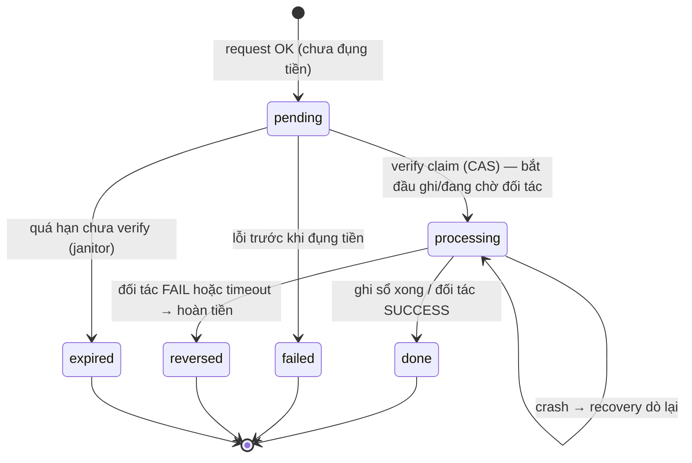
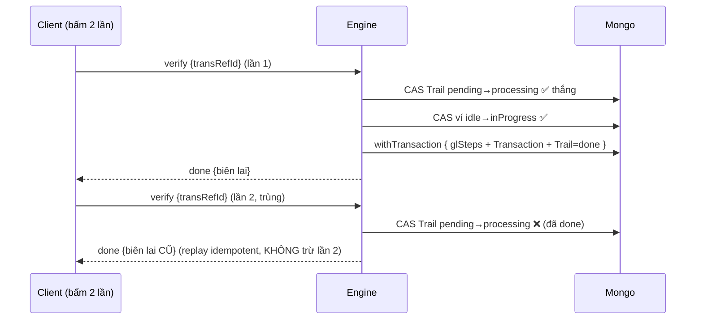
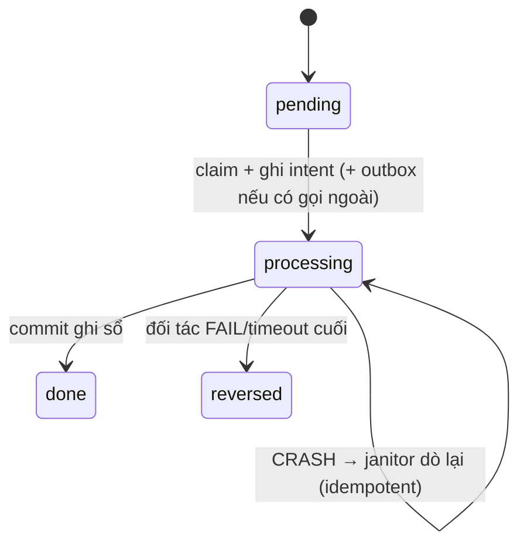

# 🛡️ Xử lý lỗi & Resilience — Mini Wallet

> Thiết kế chịu lỗi cho engine giao dịch, tập trung 3 ca thầy yêu cầu: **(1) spam/duplicate request**, **(2) gọi biller/đối tác bị timeout**, **(3) server crash khi đang xử lý dở**. Kèm các cải thiện toàn vẹn tiền tệ. Tài liệu này bổ sung cho [`THIET-KE-TUAN-2.md`](../THIET-KE-TUAN-2.md) và [`THIET-KE-ENGINE-TONG-QUAT.md`](../THIET-KE-ENGINE-TONG-QUAT.md).

## Mục lục

0. Nguyên tắc chung
1. Trạng thái & bất biến (state machine mở rộng)
2. Ca 1 — Spam / Duplicate request (idempotency + double-submit)
3. Ca 2 — Gọi biller/đối tác timeout (giao dịch "in-doubt")
4. Ca 3 — Server crash giữa chừng (atomicity + recovery)
5. Cải thiện thêm (toàn vẹn tiền tệ, khoá có hạn, outbox, rate-limit)
6. Thay đổi data model (tóm tắt)
7. Thay đổi engine (pseudo-code)

---

## 0. Nguyên tắc chung

Bốn nguyên tắc xuyên suốt mọi ca lỗi:

1. **Idempotent theo `transRefId`** — mỗi giao dịch chỉ "ghi sổ" đúng một lần, dù client/đối tác gọi lại bao nhiêu lần. `transRefId` là khoá chống trùng ở mọi tầng (engine, DB, đối tác).
2. **Atomic ghi sổ** — toàn bộ bút toán + tạo `Transaction` + lật `Trail` nằm trong **một** `session.withTransaction`. Crash giữa chừng ⇒ rollback sạch, không có nửa vời.
3. **Không bao giờ mất/đẻ tiền** — tiền đang "đi" luôn nằm ở ví **suspense**; mọi thứ chưa chắc chắn (in-doubt) **không** kết luận vội mà chuyển sang `processing` để đối soát.
4. **Có thể phục hồi** — trạng thái đủ để một **job janitor** chạy lại lúc khởi động/định kỳ: chốt, hoàn, hoặc mở khoá những gì treo.

> Mệnh đề an toàn: *"Mọi đường thoát của giao dịch (thành công, lỗi, timeout, crash) đều đưa hệ thống về một trạng thái nhất quán — hoặc hoàn tất, hoặc hoàn nguyên, hoặc treo-có-kiểm-soát chờ đối soát; không bao giờ trừ tiền hai lần và không bao giờ làm lệch tổng số dư."*

---

## 1. Trạng thái & bất biến

`TransactionTrail.status` (mở rộng):



Bất biến (kiểm bằng job ở §5):

- **I1** `Σ balance mọi ví = hằng số` (tiền không tự sinh/mất).
- **I2** Mỗi `(transRefId, stepOrder)` chỉ có **đúng 1** `PocketEntry` (không ghi trùng bút toán).
- **I3** Mỗi `transRefId` chỉ có **tối đa 1** `Transaction` thành công.
- **I4** Ví ở `state='inProgress'` luôn có một Trail `processing` tương ứng còn sống; ngược lại là khoá mồ côi → janitor mở.

---

## 2. Ca 1 — Spam / Duplicate request

**Tình huống:** người dùng bấm "Xác nhận" nhiều lần, hoặc client tự retry khi mạng chập chờn, hoặc kẻ xấu bắn song song nhiều verify cùng `transRefId` → nguy cơ **trừ tiền nhiều lần**.

### 2.1 Bốn lớp phòng vệ (defense-in-depth)

| Lớp                    | Cơ chế                                                                                                                                                                                            | Chặn được gì                                  |
| ----------------------- | --------------------------------------------------------------------------------------------------------------------------------------------------------------------------------------------------- | -------------------------------------------------- |
| L1 — Claim Trail (CAS) | Verify chỉ tiếp tục nếu**đổi được** `pending → processing` bằng `findOneAndUpdate({_id, status:'pending'}, {$set:{status:'processing'}})`. Chỉ **một** request thắng. | 2 verify song song cùng`transRefId`             |
| L2 — Khoá ví (CAS)   | Khoá ví nguồn`idle → inProgress` (cũng atomic). Người thua nhận `409`.                                                                                                                  | 2 giao dịch khác nhau cùng rút 1 ví song song |
| L3 — Unique index DB   | `Transaction.transRefId` unique; `PocketEntry (transRefId, stepOrder)` unique.                                                                                                                  | Ghi sổ trùng kể cả khi logic hở               |
| L4 — Replay idempotent | Verify trên Trail đã`done` **không lỗi** mà **trả lại đúng biên lai cũ**; trên `failed/reversed` trả lại kết quả cuối.                                            | Client retry sau khi đã xong                     |

### 2.2 Idempotency cho bước Request

Client gửi kèm `clientRequestId` (UUID sinh ở máy khách). Engine đặt **unique index** `(USERID, serviceCode, clientRequestId)` trên Trail: request lặp lại với cùng key ⇒ trả lại **Trail cũ** thay vì tạo mới. Tránh "rác" hàng loạt Trail và preview phí lệch nhau.

### 2.3 Luồng verify chống double-submit



> Phòng tuyến cuối: `unique(transRefId, stepOrder)` ở `PocketEntry` khiến lần ghi thứ hai (nếu lọt) bị DB từ chối → transaction abort → không trừ tiền.

Bổ sung: **rate-limit** mềm theo user (vd ≤ N verify/giây) để hạ tải khi bị bắn dồn.

---

## 3. Ca 2 — Gọi biller/đối tác bị timeout

**Tình huống:** ở Verify, engine gọi `paymentUrl` của biller (hoặc cổng payout). Đối tác **không trả lời kịp** → ta **không biết** họ đã trừ tiền hay chưa. Đây là giao dịch **in-doubt** — nguy hiểm nhất.

### 3.1 Phân loại kết quả lời gọi đối tác

| Kết quả                                                                          | Ý nghĩa                               | Hành động                                                 |
| ---------------------------------------------------------------------------------- | --------------------------------------- | ------------------------------------------------------------ |
| **Success** (có mã xác nhận)                                             | Đối tác đã xử lý                 | Ghi sổ →`done`                                           |
| **Business decline** (đối tác trả lỗi rõ ràng, vd sai mã hoá đơn) | Chắc chắn KHÔNG xử lý              | `failed`, **không** ghi sổ                         |
| **Connect refused / DNS** (chưa gửi đi được)                           | Chắc chắn chưa xảy ra               | `failed`, không ghi sổ                                   |
| **Timeout / 5xx / mất kết nối giữa chừng**                              | **Không rõ** đã xử lý chưa | →**`processing`** + đối soát (KHÔNG kết luận) |

### 3.2 Quy tắc vàng cho ca in-doubt

1. **Idempotency key gửi đối tác** = `transRefId` (header `Idempotency-Key`). Nếu trước đó request đã tới được đối tác, lần gọi lại sẽ trả về **cùng kết quả** chứ không tính phí lần hai.
2. **Đặt tiền vào suspense trước, gọi đối tác sau** (đối với payout liên NH): Verify ghi `khách → SUSPENSE` (committed), set `processing`, rồi mới gọi đối tác. Nhờ vậy dù timeout, tiền khách đã được "giữ" minh bạch, chưa rời hệ thống.
3. **Đối soát bằng `status(refId)`**: một job hỏi lại đối tác trạng thái `transRefId`:
   - đối tác `SUCCESS` → chốt `SUSPENSE → đích`, Trail `done`.
   - đối tác `FAILED` → hoàn `SUSPENSE → khách`, Trail `reversed`.
   - vẫn `UNKNOWN` sau `maxRetries`/quá `timeoutSec` → giữ `processing`, đẩy vào **hàng đợi đối soát thủ công** + cảnh báo.
4. **Timeout call có kiểm soát**: mỗi Connector có `timeoutMs`, **retry có backoff** chỉ cho lỗi mạng (idempotent), **không retry** lỗi business.

### 3.3 Sequence — Bill payment timeout

```mermaid
sequenceDiagram
    participant EN as Engine
    participant BL as Biller (mock)
    participant DB as Mongo
    participant JOB as Job đối soát
    EN->>DB: CAS pending→processing ; (nếu cần) khách→SUSPENSE ; ghi intent
    EN->>BL: POST payment {refId, amount} [Idempotency-Key=refId, timeout=8s]
    alt Trả Success
        BL-->>EN: success {billerRef}
        EN->>DB: withTransaction { ghi sổ → done }
    else Business decline
        BL-->>EN: declined
        EN->>DB: reverse/huỷ → failed (không ghi sổ)
    else TIMEOUT (in-doubt)
        BL--xEN: (không trả lời)
        EN->>DB: giữ Trail=processing (KHÔNG kết luận)
        Note over JOB,BL: sau vài giây
        JOB->>BL: GET status {refId}
        alt SUCCESS
            JOB->>DB: ghi sổ → done
        else FAILED
            JOB->>DB: hoàn tiền → reversed
        else vẫn UNKNOWN
            JOB->>DB: giữ processing + cảnh báo đối soát tay
        end
    end
```

---

## 4. Ca 3 — Server crash giữa chừng

**Tình huống:** tiến trình chết khi (a) đang ghi sổ dở (mới trừ ví gửi, chưa cộng ví nhận), hoặc (b) đã gọi đối tác xong nhưng chưa kịp ghi sổ, hoặc (c) để lại ví `inProgress` và Trail `processing` treo vĩnh viễn.

### 4.1 Chống "ghi sổ nửa vời" — Atomicity

Toàn bộ chuỗi `glSteps + insert Transaction + flip Trail` chạy trong **một** `session.withTransaction` (yêu cầu MongoDB **replica set**). Crash bất kỳ lúc nào trước commit ⇒ Mongo rollback toàn bộ ⇒ **không có nửa vời**.

> ⚠️ Cảnh báo nợ kỹ thuật: bản hiện tại có nhánh *fallback ghi không-transaction* (khi chưa bật được replica-set discovery) — nhánh này **không an toàn khi crash**. Production **bắt buộc** bật replica set và **tắt fallback** (xem §7).

### 4.2 Phục hồi sau crash — Janitor / Recovery job

Chạy **lúc lift** (bootstrap) và **định kỳ** (cron). Quét theo trạng thái:

| Tìm thấy                                                                         | Nghĩa                                          | Hành động phục hồi                                                                                                                                                                                          |
| ---------------------------------------------------------------------------------- | ----------------------------------------------- | ---------------------------------------------------------------------------------------------------------------------------------------------------------------------------------------------------------------- |
| Trail`pending` quá `requestTtl`                                               | Khách bỏ ngang sau request                    | →`expired` (chưa đụng tiền, an toàn)                                                                                                                                                                     |
| Trail`processing` quá `staleAfter`                                            | Crash giữa verify, hoặc đang chờ đối tác | Dò: có`Transaction(transRefId)` chưa? Có → chỉ cần flip `done`. Chưa, có hook đối tác → gọi `status(refId)` → settle/reverse. Không → tiền còn ở suspense/khách → hoàn `reversed` |
| Ví`inProgress` nhưng Trail đã kết thúc / `lockedAt` quá `lockLeaseMs` | **Khoá mồ côi** do crash               | Mở khoá`inProgress → idle`                                                                                                                                                                                  |

Nhờ **I2** (`unique(transRefId, stepOrder)`), recovery **chạy lại ghi sổ idempotent**: step nào đã có PocketEntry thì bị bỏ qua, không trừ lần hai.

### 4.3 Ghi "ý định" trước (write-ahead intent)

Trail lưu **kế hoạch** (`outputMessage.TRANSBODY` + bản chụp `glSteps` đã resolve) **trước** khi đụng tiền. Sau crash, recovery có đủ dữ kiện để tái lập chính xác việc cần làm — không phải đoán.

### 4.4 Crash quanh lời gọi đối tác → Outbox

Lời gọi ra ngoài (biller/payout) được ghi là một bản ghi **Outbox** đính kèm trong transaction tạo intent. Một worker đọc Outbox để thực hiện gọi (idempotency key = `transRefId`):

- Crash **trước** khi gọi → worker gọi lại (chưa gửi, an toàn).
- Crash **sau** khi gọi, **trước** khi ghi kết quả → idempotency key khiến lần gọi lại trả về kết quả cũ, không double-charge.



---

## 5. Cải thiện thêm (tự đề xuất)

1. **Job toàn vẹn tiền tệ (integrity sweeper):** định kỳ kiểm **I1** (tổng số dư = hằng số) và verify lại `checksum` mọi ví; lệch → khoá `frozen` + cảnh báo. Phát hiện cả sửa DB trái phép lẫn bug ghi sổ.
2. **Khoá có hạn (lock lease):** ví lưu `lockOwner=transRefId` + `lockedAt`. Mở khoá tự động khi quá `lockLeaseMs` (tránh kẹt ví do crash). Thay cho khoá "vĩnh viễn".
3. **Reconciliation/đối soát đối tác:** mỗi connector có ví `nostro`; cuối ngày so `Σ PocketEntry` vào nostro với sao kê đối tác → liệt kê chênh lệch (chính là các Trail `processing` treo).
4. **Rate-limit theo user** trên các route `txn/*` (chặn spam ở cửa, trước cả L1).
5. **Đánh số nỗ lực & log từng stage:** `transStepLog[]` ghi mọi bước (input/output/thời điểm/lỗi) phục vụ gỡ lỗi & recovery; `attempts`/`lastError` trên Trail.
6. **Phân loại lỗi rõ ràng** ở Connector driver: `business` (abort) · `network/timeout` (in-doubt → processing) · `connect-refused` (abort). Quyết định settle/reverse dựa trên phân loại này, không đoán.
7. **Hàng đợi đối soát thủ công (dead-letter):** in-doubt không tự giải quyết sau N lần → chuyển trạng thái `needsManualReview` cho Officer xử lý ở Admin.

---

## 6. Thay đổi data model (tóm tắt)

| Model                                                | Thêm field                                                                                                       | Mục đích                                |
| ---------------------------------------------------- | ----------------------------------------------------------------------------------------------------------------- | ------------------------------------------ |
| `TransactionTrail`                                 | `clientRequestId` (unique theo user+service), `attempts`, `lastError`, `externalRef`, `processingSince` | Idempotency request, recovery, đối soát |
| `TransactionTrail.status`                          | thêm`processing`, `reversed`, `expired`                                                                    | State machine chịu lỗi                   |
| `Pocket`                                           | `lockOwner` (=transRefId), `lockedAt`                                                                         | Khoá có hạn + recovery khoá mồ côi   |
| `Pocket.ownerType`                                 | thêm`suspense`, `nostro`                                                                                     | Giữ tiền in-doubt + đối soát          |
| `Transaction`                                      | **unique** `transRefId`                                                                                   | Chặn ghi sổ trùng (I3)                  |
| `PocketEntry`                                      | **unique** `(transRefId, stepOrder)`                                                                      | Chặn bút toán trùng (I2)               |
| `Connector` *(mới, từ thiết kế tổng quát)* | `timeoutMs`, `maxRetries`, `operations.*.idempotent`                                                        | Gọi đối tác an toàn                   |
| `Outbox` *(mới, tuỳ chọn)*                    | `transRefId`, `connector`, `operation`, `payload`, `status`, `attempts`                               | Gọi ngoài bền vững qua crash           |

---

## 7. Thay đổi engine (pseudo-code)

```js
// VERIFY — chống double-submit + atomic + recovery-friendly
async function processVerify(transRefId, pin, ctx) {
  // L1: CLAIM trail bằng CAS — chỉ một request thắng
  const claimed = await Trail.cas(transRefId, { status: 'pending' }, { status: 'processing', processingSince: Date.now() });
  if (!claimed) {
    const t = await Trail.findOne(transRefId);
    if (t && t.status === 'done')   return replayResult(t);   // L4: replay idempotent
    if (t && ['failed','reversed','expired'].includes(t.status)) return finalResult(t);
    throw fail(409, 'Giao dịch đang được xử lý hoặc không hợp lệ');
  }

  let locked = false;
  try {
    // dựng lại field + fee + validate (không tin số cũ)
    const body = rebuild(claimed); validateFields(); computeFee(); 

    // L2: khoá ví nguồn (CAS) + lease
    locked = await Pocket.casLock(body.SENDERID, transRefId);   // idle→inProgress, set lockOwner/lockedAt
    if (!locked) throw fail(409, 'Ví đang bận');

    checkAuth(pin); await validateBusiness(body);

    // (nếu có hook đối tác) → đặt tiền vào suspense, ghi Outbox, gọi đối tác có timeout+idempotency
    //   business-decline → reverse→failed ; timeout → giữ processing (janitor lo) ; success → tiếp

    // ATOMIC: glSteps + Transaction(unique transRefId) + PocketEntry(unique stepOrder) + Trail=done
    await withTransaction(session => executeLedger(body, transRefId, session));
    return doneResult();
  } catch (e) {
    if (isInDoubt(e)) { /* giữ processing, KHÔNG reverse vội */ throw e; }
    await Trail.set(transRefId, { status: 'failed', lastError: e.message });
    throw e;
  } finally {
    if (locked) await Pocket.unlock(body.SENDERID, transRefId);  // mở khoá mọi lối ra
  }
}

// JANITOR — chạy lúc bootstrap + định kỳ
async function recover() {
  for (const t of await Trail.find({ status: 'pending', createdAt: { '<': now - requestTtl } }))
    await Trail.set(t.id, { status: 'expired' });

  for (const t of await Trail.find({ status: 'processing', processingSince: { '<': now - staleAfter } })) {
    if (await Transaction.exists(t.id)) { await Trail.set(t.id, { status: 'done' }); continue; }
    if (t.hasExternalHook) await reconcileWithPartner(t);     // status(refId) → settle|reverse
    else await reverseToSender(t);                            // tiền chưa rời → hoàn
  }

  for (const p of await Pocket.find({ state: 'inProgress', lockedAt: { '<': now - lockLeaseMs } }))
    await Pocket.unlock(p.id);                                // mở khoá mồ côi
}
```

> Tóm lại: **claim CAS** giết spam; **suspense + idempotency-key + status-poll** xử lý timeout; **withTransaction + janitor + unique index** sống sót qua crash. Ba cơ chế dùng chung một state machine và một `transRefId`.

